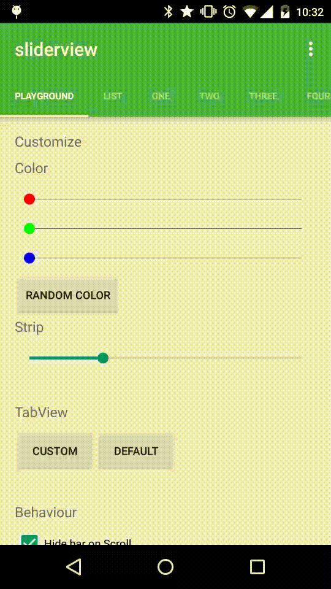
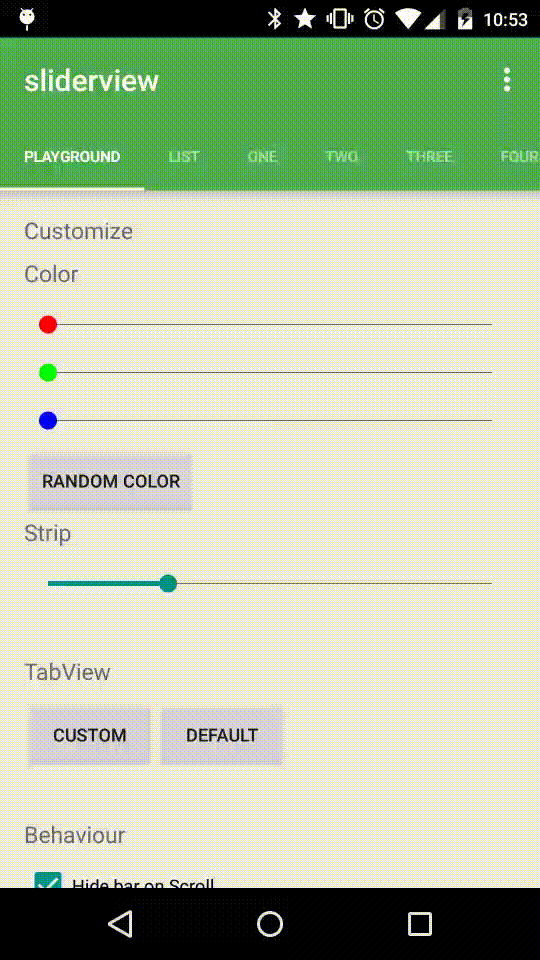
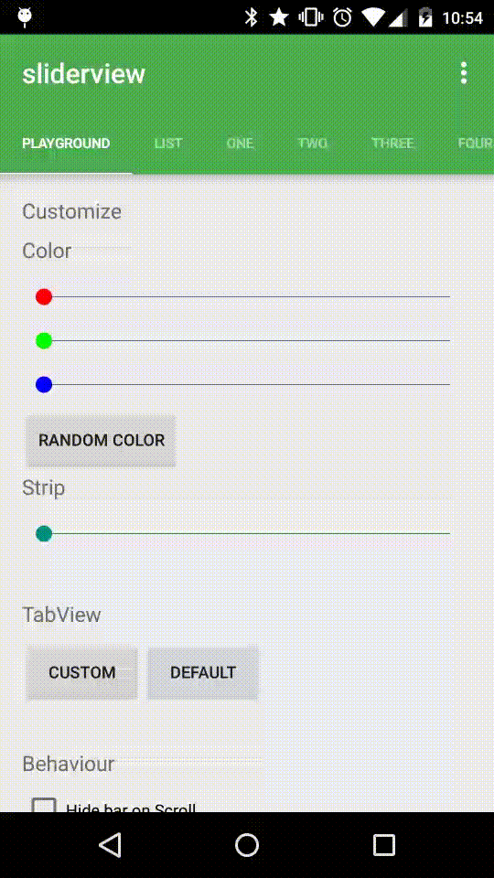
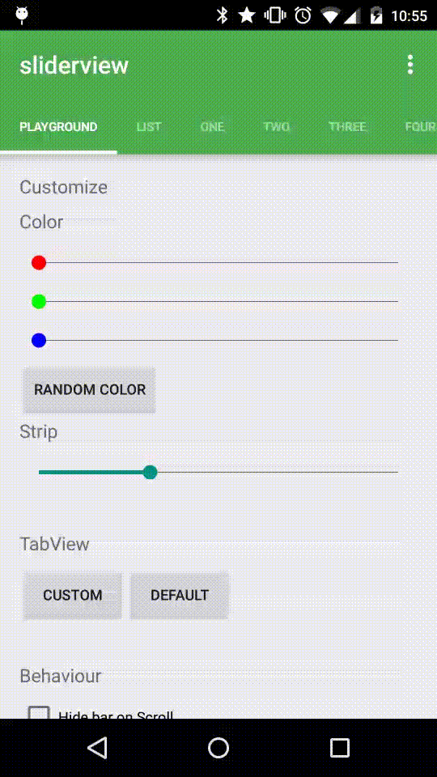
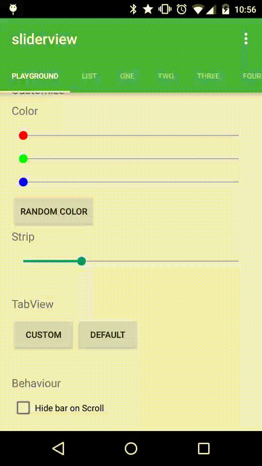

# android-sliderview

Inspired by [SlidingTabBasic](https://developer.android.com/samples/SlidingTabsBasic/index.html)

### Customize colors

### Customize strip

### Change the `tabViews`

### Hide the `ActionBar` on scroll

## License

MIT
